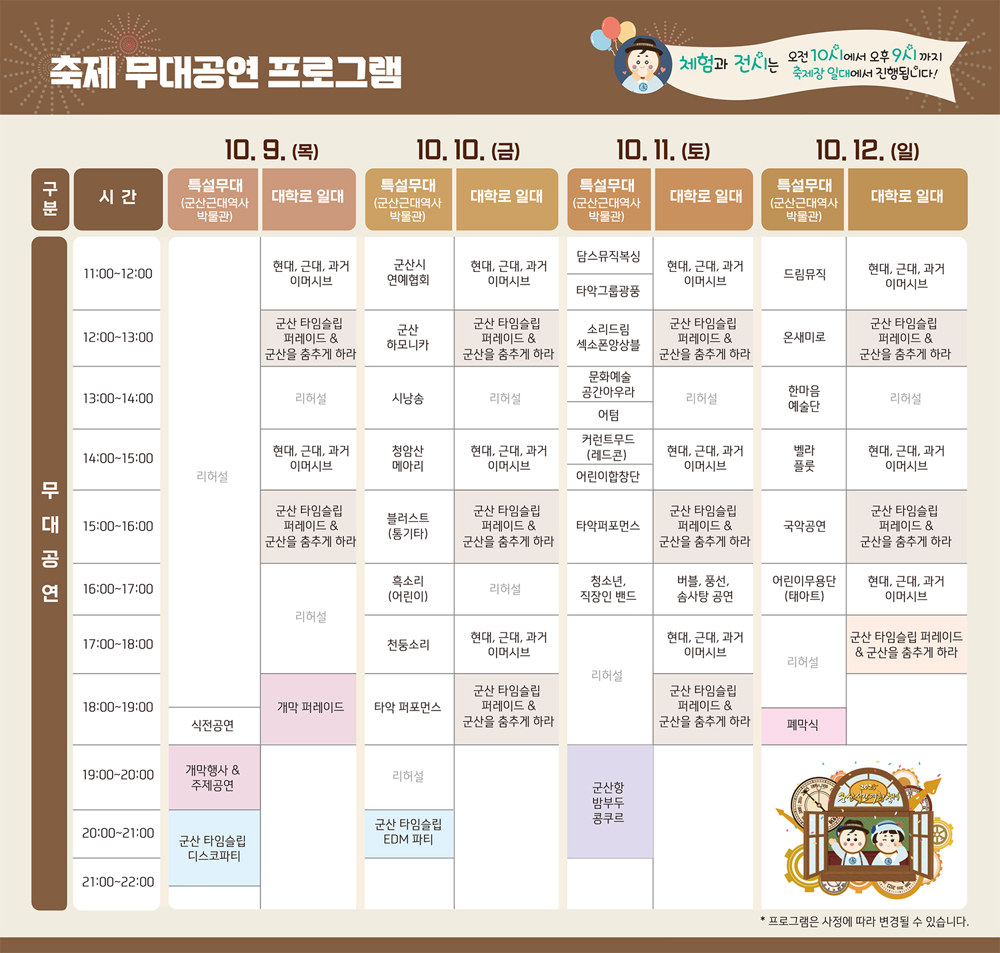
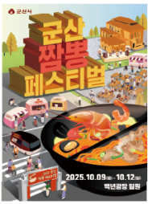

# 군산 당일치기 여행 계획 🚗
- [군산 당일치기 여행 계획 🚗](#군산-당일치기-여행-계획-)
  - [참고 url](#참고-url)
  - [📅 시간별 일정표](#-시간별-일정표)
  - [🍽️ 식사 추천 장소](#️-식사-추천-장소)
  - [📝 체크리스트](#-체크리스트)
  - [💡 여행 팁](#-여행-팁)
  - [📷 이미지](#-이미지)

## 참고 url
- [군산시간여행축제 블로그 - https://blog.naver.com/samchun2g/224035418276](https://blog.naver.com/samchun2g/224035418276)
- [군산시간여행축제 공식 홈페이지 PDF - https://festival.gunsan.go.kr/](https://festival.gunsan.go.kr/files/2025%EA%B5%B0%EC%82%B0%EC%8B%9C%EA%B0%84%EC%97%AC%ED%96%89%EC%B6%95%EC%A0%9C%EB%A6%AC%ED%94%8C%EB%A0%9B.pdf)
    > 주차장 주소 포함

**날짜**: 2025년 10월 11일 (토)  
**이동수단**: 자동차 🚗

## 📅 시간별 일정표

| 시간  | 일정                     |     장소      | 비고                        |
| ----- | ------------------------ | :-----------: | --------------------------- |
| 07:30 | 출발(대전)               |      집       |                             |
| 09:00 | 군산 시간 여행 축제      |               |                             |
| 10:00 | 먹거리장터 구경          |               |                             |
| 11:00 | 군산근현대사 박물관 관람 |               |                             |
| 12:00 | 점심식사                 | 짬뽕 페스티벌 |                             |
| 13:00 | 오락난장, 군산다방체험   | 퍼레이드 거리 |                             |
| 14:30 | 군산타임슬립퍼레이드     | 퍼레이드 거리 |                             |
| 16:00 | 이성당                   |       -       | 근대역사박물관에서 도보 7분 |
| 18:00 | 저녁식사                 |     [TBD]     |                             |

## 🍽️ 식사 추천 장소
- **추천1**: 빈해원 (물짜장)

<!-- ### 점심 🍽️
- **추천2**: 복성루 (중화요리)
- **추천3**: 군산오징어 (해산물 요리)

### 저녁 🍽️
- **추천3**: 맛나감자탕 (감자탕) -->

## 📝 체크리스트
- [ ] 텀블러 2개 챙기기(텀플러 이벤트 있음)
- [ ] 영수증 챙기기(기념품 교환 가능-7만원 이상)
- [ ] 보조배터리
- [ ] 날씨 확인 및 옷차림
- [ ] 현금 준비 (주차비, 입장료)

## 💡 여행 팁
- 군산은 근대문화유산이 많아 걸어서 둘러보기 좋은 도시입니다
- 이성당 단팥빵은 군산의 대표 먹거리이니 꼭 맛보세요
- 주차는 근대역사박물관 주차장을 기점으로 도보 이동하는 것이 효율적입니다
- 일몰 시간을 고려하여 진포해양테마공원에서 석양 감상도 추천합니다

## 📷 이미지 

* 시간여행축제

    

        
    

* 짬뽕축제

    

        
    

