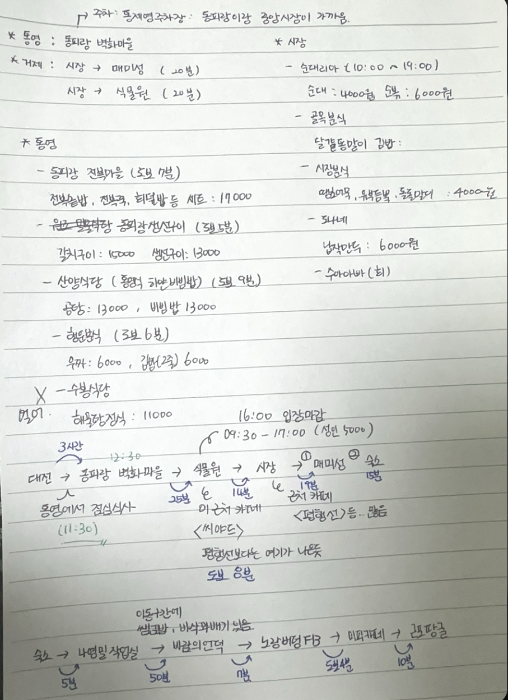

2025 여행일정 - 거제도 2박 3일 🦈

기간 : 2025년 12월 26일 ~ 2025년 12월 28일 

- 준비물
    - [ ] 라면, 햇반, 소화제, 커피, 호일(찢어서)
    - [ ] 소세지, 청양고추, 양파, 피망, 팽이버섯
    - [x] 보조배터리, 충전기
    - [ ] 스테이크, 시즈닝 
    - [x] 폼클렌징, 치약, 칫솔
    - [ ] 속옷, 양말, 잠옷
    - [ ] 깁스 커버 

---

| 날짜           | 시간 A     | 소요시간 | 시간 B     | 내용                                              | 구분              | 요금(원) |
| -------------- | ---------- | -------- | ---------- | :------------------------------------------------ | ----------------- | -------: |
| **First Day**  | 오전 8:00  | +3:00    | 오전 11:00 | 🚗 집 → 산양식당                                   | ⛽ 연료비 + 통행료 |   46,718 |
|                | 오전 11:00 | +1:00    | 오후 12:00 | 🍚 통영식 하얀비빔밥                               | 🍽️ 식비            |   30,000 |
|                | 오후 12:00 | +1:00    | 오후 1:00  | 🎨 동피랑 벽화마을                                 | 🎟️ 입장료          |        0 |
|                | 오후 1:00  | +2:00    | 오후 3:00  | 🌿 거제식물원                                      | 🎟️ 입장료          |   10,000 |
|                | 오후 3:00  | +1:00    | 오후 4:00  | ☕ 시야드 카페                                     | ☕ 카페            |   25,000 |
|                | 오후 4:00  | +1:30    | 오후 5:30  | 🏪 거제고현시장 (순대·김밥·만두)                   | 🍽️ 식비            |   20,000 |
|                | 오후 5:30  | +0:30    | 오후 6:00  | 🛒 저녁 장보기 (술·음료·물·햇반)                   | 🍽️ 식비            |   15,000 |
|                | 오후 6:00  | +0:30    | 오후 6:30  | 🚗 숙소 이동                                       | ⛽ 연료비          |        0 |
|                | 오후 6:30  | +2:30    | 오후 9:00  | 🍲 저녁식사                                        | 🍽️ 식비            |        0 |
| **Second Day** | 오전 9:45  | +2:15    | 오후 12:00 | 🍞 나영밀작업실                                    | 🍽️ 식비            |   40,000 |
|                | 오후 12:00 | +2:00    | 오후 2:00  | 🌬️ 바람의 언덕 (쌤김밥·꽈배기)                     | 🍽️ 식비            |    7,000 |
|                | 오후 2:00  | +0:40    | 오후 2:40  | 🌭 노랑버덩FB (핫도그)                             | 🍽️ 식비            |    7,000 |
|                | 오후 2:40  | +1:20    | 오후 4:00  | ☕ 미피카페                                        | 🍽️ 식비            |   20,000 |
|                | 오후 4:00  | +1:00    | 오후 5:00  | 📸 근포땅굴 (사진 촬영)                            | ⛽ 연료비          |        0 |
|                | 오후 5:00  | +4:00    | 오후 9:00  | 🍲 저녁 (대구탕) 후 숙소 이동 - 거제도신대구탕 | 🍽️ 식비            |   45,000 |
| **Third Day**  | 오전 8:00  | +2:00    | 오전 10:00 | 🧳 아침식사 및 퇴실                                | 🍽️ 식비            |        0 |
|                | 오전 10:00 | +2:00    | 오후 12:00 | 🏰 매미성                                          | ⛽ 연료비          |        0 |
|                | 오후 12:00 | +4:00    | 오후 4:00  | 🚗 우리 집으로                                     | ⛽ 연료비 + 통행료 |   46,718 |
| **합계**       |            |          |            |                                                   |                   |  312,436 |

    

